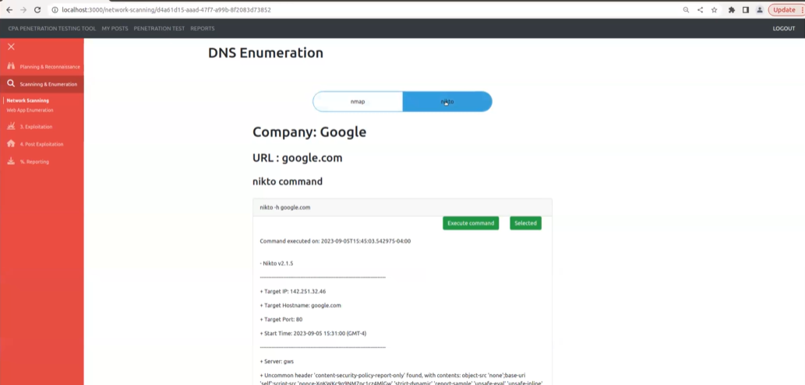

# CPA Penetration Testing Tool (cpa-pen-testing-tool)

## Overview

CPA Penetration Testing Tool is a web based tool to automate reconnaissance, scanning and enumeration for the given domain. It improves testing efficiency, and uncover issues that are difficult to discover with manual analysis techniques alone. Once threats and vulnerabilities are assessed, penetration testers provide a report that can help the organization address the identified risks to improve their cyber defenses.

## Features

* Create an account and login

* gather initial information and reconnaissance using the following tools:
    * whois: Used for domain name registration information lookup.
    * ping:  Used to test the reachability of a host on an Internet Protocol (IP) network. 

* Integrated DNS Enumeration tools:
    * dig: Used for DNS queries and zone transfers.
    * nslookup: Used for DNS enumeration and scanning.

| dig | nslookup |
|---|---|
| ||

* shodan: Used for discovering internet-connected devices and systems.

* Integrated Network scanning tools:
    * nmap: Used for port scanning and network exploration.
    * nikto: 

| nmap | nikto |
|---|---|
|  |  |

* Integrated Web Application Enumeration tools:
    * ffuf: Used for directory and file discovery on web servers.
    * dirb: similar to ffuf
    * wfuzz: Used for web application brute-forcing.
    * wappalyzer: Used for web application technology identification.

| dirb ||||
|---|---|---|---|
|  |  |||

## Specifications

This a simple web blog created by using React for frontend and Gin (Golang) framework for backend. This repository is created as a support for the [guide](https://letscode.blog/category/gin-golang-and-react-web-app-guide/) about implementing Gin backend from the scratch.
